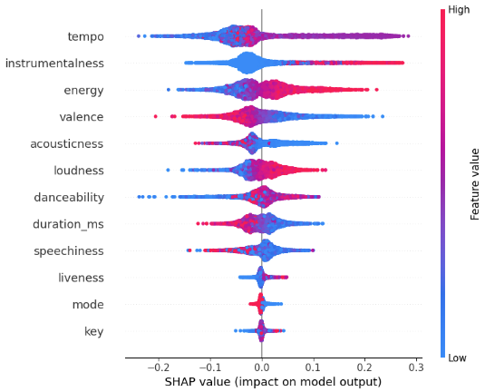

# 🎵 The Anatomy of a Spotify Hit: Decoding Song Popularity

<table>
  <tr>
    <td></td>
    <td></td>
  </tr>
</table>


 


---

This project dives deep into understanding what makes a song popular on Spotify using statistical analysis, machine learning, and explainability tools. By leveraging audio and metadata features, we built predictive models and interpreted their inner workings using SHAP to uncover the driving forces behind track popularity.

## 📌 Project Highlights

- **Data Source**: Spotify song-level dataset including audio features like tempo, danceability, valence, energy, and track popularity.
- **Objective**: Predict whether a song is “popular” and identify the most influential features.
- **Approach**:
  - Feature exploration, correlation mapping, and normalization
  - Building a **Random Forest Classifier** for popularity classification
  - Applying **SHAP (SHapley Additive exPlanations)** to interpret feature importance

## 🧠 Machine Learning Model: Random Forest

We trained a `RandomForestClassifier` with 100 estimators to classify songs based on their popularity. The model showed strong performance and robustness across test sets.

```python
from sklearn.ensemble import RandomForestClassifier
rf_classifier = RandomForestClassifier(n_estimators=100, random_state=42)
rf_classifier.fit(X_train, y_train)
```

Accuracy on the test set was evaluated using standard metrics like accuracy and confusion matrix.

## 🔍 Model Interpretability with SHAP

To move beyond accuracy and explore *why* the model made certain predictions, we used **SHAP**—a state-of-the-art interpretability framework.

```python
import shap
explainer = shap.Explainer(rf_classifier)
shap_values = explainer.shap_values(X_test)
shap.summary_plot(shap_values, X_test)
```

These plots showed which features (e.g., **energy**, **danceability**, **valence**) most impacted a song’s predicted popularity. SHAP enabled a clearer understanding of model behavior and helped validate real-world relevance.

## 📈 Visual Storytelling

The project leverages:
- **Plotly** for interactive correlation visualizations
- **Seaborn** and **Matplotlib** for EDA and SHAP summaries
- Feature correlation bars normalized and plotted to highlight impactful traits of hit songs

## 🛠️ Tech Stack

- Python, Pandas, NumPy
- scikit-learn, SHAP
- Plotly, Seaborn, Matplotlib
- Jupyter Notebook

## 🚀 Key Takeaways

- Danceability, energy, and valence are strong predictors of popularity.
- SHAP helps bridge the gap between black-box models and stakeholder-friendly insights.
- Visualizing model behavior is just as important as building an accurate model.
